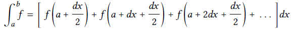

# 1.3 Formulating Abstractions with High Order Procedures
Procedures that can accept procedures as arguments or return value are called high order procedure.   
This also means 

# 1.3.1 Procedures as Arguments

- **Example #1:   sum of integers between [a b]**

```
    (define (sum-integers a b)
      (if(> a b)
        0
        (+ a (sum-integers (+ a 1) b))))
```
- **Example#2: sum of cube between [a b]**

```
    (define (sum-cubes a b)
      (if(> a b)
        0
        (+ (cube a) (sum-cubes (+ a 1) b))))
```
- **Example #3: compute a sequence of terms as below series:**  
   1/(\* 1 3) + 1/(\* 5 7) + 1/(\* 9 11) + ...... + 1/(\* (4n+1) (4n+3)) + ......

```
    (define (sum-pi a b)
      (if(> a b)
        0
    	(+ (/ 1 (* a (+ a 2))) (sum-pi (* 4 a) b))))
```

To define an abstract common procedure for above three procedures: 

```
(define (<name> a b)
  (if(> a b)
    0
    (+ (<term> a) (<name> (<next> a) b))))
```
Here,   
- \<name> : procedure name   
- \<term> : procedure to process each accumulating element.  
- \<next> : procedure to iterate to the next step.  

**Example #4:  general sum procedure**

```
(define (sum a b term next)
  (if(> a b)
    0
    (+ (term a) (sum (next a) b term next))))

- example #1
(define (term-integer a) a)
(define (next-integer a) (+ a 1))
(define (sum-integers a b) (sum a b term-integer next-integer))

- example #2
(define (term-cube a) (* a a a))
(define (sum-cubes a b) (sum a b term-cube next-integer))

- exmaple #3
(define (term-pi a) (/ 1 (* a (+ a 2))))
(define (next-pi a) (+ 4 a)))
(define (sum-pi n) (* 4 (sum 1.0 n term-pi next-pi)))
```
**Example #5 definite integral 任意函数的[0 1]有限积分**  


```
(define (integral f a b dx)
  (define (add-dx x) (+ x dx))
  (* (sum (+ a (/ dx 2.0)) b f add-dx) dx))

```

## Exercise 1.29 Simpson's Rule Algorithm  
### recursive procedure

```
(define (si f a b n)
  (let ((h (/ (- b a) n)))
    (define (next x) (+ x 1))
    (define (term_yk k) (f (+ a (* k h))))
    (* (/ h 3)
       (+ (term_yk 0)
          (sum 1 (- n 1) term_yk next)
          (term_yk n)))))
(define (sum a b term next)
  (if(> a b)
     0
     (+ (* (if(even? a) 2 4)
           (term a))
        (sum (next a) b term next))))

(define (cube x) (* x x x))


(si cube 0 1.0 100) = 0.24999999999999992
```
**Note**:
- **let** is a lisp syntax which is used to define a variable expression.
- example : let **((**h (/ (- b a) n)**))**  variable **h** must be double **(())**.

### iterative procedure

```
(define (si f a b n)
  (let ((h (/ (- b a) n)))
    (define (next x) (+ x 1))
    (define (term_yk k) (f (+ a (* k h))))
    (* (/ h 3)
       (+ (term_yk 0)
          (sum 1 (- n 1) term_yk next)
          (term_yk n)))))

(define (sum a b term next)
  (define (iter-sum a result)
    (if(> a b) 
	  result
	  (iter-sum (next a) 
	            (+ (* (if(even? a) 2 4) (term a))
				   result))))
  (iter-sum a 0))

(define (cube x) (* x x x))

(si cube 0 1.0 1000) = 0.25000000000000006
```

## Exercise 1.31 Abstrac procedure for multiplication

### recursive procedure
```
(define (product term a b next)  
  (if(> a b)
    1
(* (term a) (product term (next a) b next))))

(define (factorial n)	
  (define (te a) a)
  (define (ne a) (+ a 1))
  (product te 1 n ne)
  
(define (pi n) 
  (define (te x) (/ (* (- x 1) (+ x 1)) (* x x)))
  (define (ne x) (+ x 2))
  (* 4 (product te 3 (+ n 2) ne)))
```
  
### iterative procedure
```
(define (producti term a b next)
  (define (iter-product a result)  
    (if(> a b)  
      result  
      (iter-product (next a) (* (term a) result))))
  (iter-product a 1))
	
(define (pii n) 
  (define (te x) (/ (* (- x 1) (+ x 1)) (* x x)))
  (define (ne x) (+ x 2))
  (* 4.0 (producti te 3 (+ n 2) ne)))

(pii 100000) = 3.1416083612781764
```

## Exercise 1.32 Abstract for both sum and product

### Collection accumulate procedure 
- **iterative implementation**

```
    (define (accumulate combiner null-value term a b next )
      (define (iter-acc a result)
        (if(> a b)
    	  result
    	  (iter-acc (next a) (combiner (term a) result))))
      (iter-acc a null-value))
```
- **recursive implementation**

```
    (define (accumulate combiner null-value term a b next )
      (if(> a b)
        null-value
        (combiner 
          (term a) 
          (accumulate combiner null-value term (next a) b next ))))
```

### Examples of using **accumulate** procedure
```
;# PI implementation based on accumulate procedure + production rule 
(define (acc-pi n)
  (define (term x) (/ (* (- x 1) (+ x 1)) (* x x)))
  (define (next x) (+ x 2))
  (define (combiner x y) (* x y))
  (* 4.0 (accumulate combiner 1 term 3 (+ n 2) next))) 
  
;# factorial implementation based on accumulate procedure  
(define (acc-factorial n)
  (define (term x) x)
  (define (next x) (+ x 1))
  (define (combiner x y) (* x y))
  (accumulate combiner 1 term 1 n next))
  
;# PI implementation based on abstract procedure + 1.3.1
(define (acc-pi-sum n)  
  (define (term-pi a) (/ 1 (* a (+ a 2))))
  (define (next-pi a) (+ 4 a))
  (define (combiner x y) (+ x y))
  (* 8 (accumulate combiner 0 term-pi 1.0 n next-pi)))

  (acc-pi-sum 1000) = 3.139592655589782
 ```
 
## Exercise 1.33 Abstract filtered-accumulate procedure 

### Accumulate with filter 
- **iterative implementation**

```
    (define (accumulate-filter combiner null-value term a b next filter)
      (define (iter-acc a result)
        (if(> a b)
          result
          (iter-acc (next a) (if(filter a) (combiner (term a) result) result))))
      (iter-acc a null-value))
```
- **recursive implementation**

```
    (define (accumulate-filter combiner null-value term a b next filter)
      (if(> a b)
        null-value
        (if(filter a)		
          (combiner 
            (term a)
            (accumulate-filter combiner null-value term (next a) b next filter))
          (accumulate-filter combiner null-value term (next a) b next filter))))
```
### example of usage
a. **Example A**: the sum of the squares of the prime numbers in the interval a to b.

```
;# prime procedure
    (define (prime? n)
      (define (divides? a b) (= 0 (remainder b a)))
      (define (find-divisor n test-divisor)
        (cond ((> (* test-divisor test-divisor) n) n)
            ((divides? test-divisor n) test-divisor)
            (else (find-divisor n (+ 1 test-divisor)))))
      (define (smallest-divisor n) (find-divisor n 2)) 
      (= n (smallest-divisor n)))
    
    ;# sum of the squares of the prime numbers in [a b]  
    (define (sum-of-square-of-primes a b)
      (define null-value 0)
      (define (combiner x y) (+ x y))
      (define (term x) (* x x))
      (define (next x) (+ x 1))
      (accumulate-filter combiner null-value term a b next prime?))  
    
    (sum-of-square-of-primes 1 2)  
```  
b. **Example B**: the product of all the positive integers less than n that are relatively prime to n (i.e., all positive integers i < n such that GCD(i,n) = 1).

```
(define (GCD a b)
  (if(= b 0)
    a
    (GCD b (remainder a b))))

(define (product-of-prime-integers-to-n n)
  (define null-value 1)
  (define (combiner x y) (* x y))
  (define (term x) x)
  (define (next x) (+ x 1))
  (define (filter x) (= 1 (GCD x n)))
  (accumulate-filter combiner null-value term 1 n next filter))   
  
(product-of-prime-integers-to-n 5) = 24
```